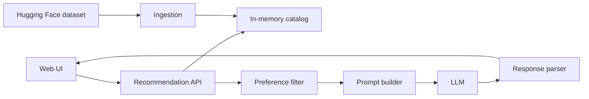
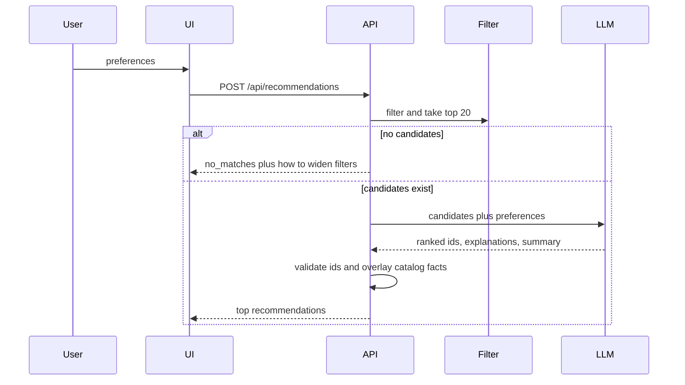

# Architecture: AI-Powered Restaurant Recommendation System

This document describes how to build the service defined in [problemStatement.md](./problemStatement.md). Structured filtering decides which restaurants are eligible. A large language model only ranks and explains that shortlist. It must not invent restaurants, ratings, or prices.

## 1. Goal and constraints

The product takes location, budget, cuisine, minimum rating, and optional free-text preferences, then returns a short ranked list with an explanation for each pick.

The data source is the Hugging Face dataset [ManikaSaini/zomato-restaurant-recommendation](https://huggingface.co/datasets/ManikaSaini/zomato-restaurant-recommendation).

| Fact | Implication |
| --- | --- |
| About 51,717 rows in `zomato.csv`, roughly 574 MB | Load once, drop heavy columns, keep a cleaned in-memory catalog |
| Listings are Bangalore restaurants | Location means a Bangalore neighborhood (`Banashankari`, `Indiranagar`, and so on), not a city such as Delhi |
| 93 `location` values, 30 `listed_in(city)` values | Populate the location control from the catalog, do not free-type arbitrary cities |
| `rate` is a string such as `4.1/5`, and includes unusable values | Parse to a float and drop rows that are not a numeric rating |
| `approx_cost(for two people)` is a string | Parse to an integer rupee amount for two people |
| The same restaurant appears more than once (`listed_in(type)` / `listed_in(city)`) | Deduplicate before ranking |
| `reviews_list` and `menu_item` can be huge | Never send them to the model. Do not keep them in the hot catalog |

The problem statement’s city examples (Delhi, Bangalore) cannot be satisfied by this dataset. If a user asks for a city outside Bangalore, the API returns a clear “not in catalog” result. Do not ask the model to fill that gap.

## 2. System shape



Five responsibilities, matching the required workflow:

1. **Ingestion** loads, cleans, deduplicates, and indexes the dataset.
2. **User input** collects preferences and only offers values the catalog can honor.
3. **Integration** filters the catalog and builds a bounded prompt from the survivors.
4. **Recommendation engine** asks the model to rank and explain those survivors, then validates the answer against the catalog.
5. **Output** shows name, cuisine, rating, estimated cost, and the model’s explanation.

The model is a reranker and writer, not the source of restaurant facts.

## 3. Runtime components

### 3.1 Catalog store

A process-lifetime singleton loaded at startup.

- Holds deduplicated `Restaurant` records.
- Holds lookup lists for the UI: locations, cuisines, and the three budget bands.
- Read-only after load. Requests never mutate it.
- If load fails, the process is not ready. `/health` reports `loading` or `failed`.

### 3.2 Preference filter

Deterministic. Same input always yields the same candidate set.

Order:

1. Drop records with no name, no numeric rating, or no numeric cost.
2. Match location (see §5.2).
3. Keep records whose cuisine list contains the requested cuisine.
4. Keep records whose rating is at least the minimum.
5. Keep records whose cost-for-two falls in the selected budget band.
6. Sort by a confidence score, then take the top 20.

Confidence score is computed in code, not by the model:

```text
score = rating * log10(votes + 1)
```

This stops a 4.9 rating with three votes from crowding out a 4.3 rating with thousands of votes before the model ever sees the list.

If the candidate set is empty, do not call the model. Return `no_matches` and the suggestions in §7.

### 3.3 Prompt builder

Turns the candidate list into a compact JSON payload. Include only:

- `id`, `name`, `location`, `cuisines`, `rating`, `votes`
- `cost_for_two`, `rest_type`, `listed_in_type`
- `online_order`, `book_table`, `dish_liked` (truncate to 120 characters)

Exclude address, phone, URL, reviews, and menu text. Phone numbers are unnecessary for ranking and should not leave the process.

### 3.4 Recommendation engine

One chat completion with a JSON response format. The model must:

- Rank only ids present in the candidate payload.
- Return at most 5 restaurants.
- Explain each pick using the supplied fields and the user’s free-text preference.
- Optionally add a one-paragraph summary of the shortlist.
- Say when a free-text preference cannot be verified from the fields (for example “family-friendly” when no field states that).

### 3.5 Response validator

Treat the model output as untrusted.

- Reject unknown ids.
- Reject duplicate ids.
- Replace any model-supplied name, cuisine, rating, or cost with the catalog values for that id.
- If the JSON is invalid or the call times out, fall back to the filter’s confidence order and mark explanations as unavailable. Still return facts. Never return a blank error when candidates exist.

## 4. Data model

### 4.1 Raw columns used

| Raw column | Use |
| --- | --- |
| `name` | Display name |
| `url` | Dedup key after stripping the query string |
| `address` | Secondary dedup signal, not shown in v1 |
| `location` | Neighborhood filter |
| `listed_in(city)` | Broader area, used only if neighborhood match fails |
| `cuisines` | Split on commas into a list |
| `rate` | Parse `4.1/5` to `4.1` |
| `votes` | Confidence score |
| `approx_cost(for two people)` | Integer cost for two |
| `rest_type` | Signal for “quick service” and similar free text |
| `dish_liked` | Signal for food-specific free text |
| `online_order`, `book_table` | Yes/No flags the model may cite |
| `listed_in(type)` | Buffet, Cafes, Delivery, Desserts, Dine-out, Drinks & nightlife, Pubs and bars |

Dropped at ingest: `phone`, `reviews_list`, `menu_item`, and the raw `address` after dedup.

### 4.2 Canonical record

```text
Restaurant
  id              string   # stable hash of normalized url path, else name+location
  name            string
  location        string   # neighborhood
  area            string   # listed_in(city)
  cuisines        string[]
  rating          float    # 0–5
  votes           int
  cost_for_two    int      # INR
  rest_type       string
  listed_in_type  string
  online_order    bool
  book_table      bool
  dish_liked      string | null
```

### 4.3 Cleaning rules

- Trim whitespace. Fix obvious encoding damage in names when it is a straight UTF-8 decode; do not invent a corrected name.
- Rating: accept only values matching `^\d(\.\d)?/5$` after trim. Drop `NEW`, `-`, empty, and values with internal spaces such as `4.1 /5`. Do not repair the space.
- Cost: strip commas and non-digits. Drop the row if nothing remains. `0` is a valid cost.
- Cuisines: split on `,`, trim, drop empties, match case-insensitively. Token equality, not a substring of another token (`Thai` must not match `Thali`).
- Dedup: group by URL path (no query). Keep the row with the highest `votes`. If votes tie, keep the higher rating. If both tie, keep the earliest dataset row.
- One location name contains a comma: `ITPL Main Road, Whitefield`. Do not split location on commas.

### 4.4 Budget bands

Compute bands once from the cleaned `cost_for_two` distribution using nearest-rank percentiles. Do not hard-code rupee cutoffs.

| Band | Rule |
| --- | --- |
| low | cost ≤ 33rd percentile |
| medium | 33rd percentile < cost ≤ 66th percentile |
| high | cost > 66th percentile |

A cost equal to the 33rd percentile is `low`, not `medium`. A cost equal to the 66th percentile is `medium`, not `high`.

Expose the resolved rupee ranges on `GET /api/meta` so the UI can show “Low (up to ₹X for two)” instead of an unlabeled word. Do not insert a thousands separator.

## 5. Request flow



### 5.1 User input

| Field | Control | Validation |
| --- | --- | --- |
| Location | Searchable select from catalog neighborhoods | Required, must be a known location |
| Budget | low / medium / high | Required. Accept case-insensitively and store lowercase |
| Cuisine | Searchable select from catalog cuisines, plus an “Any” option | Required. `Any` is a sentinel, not a stored cuisine |
| Minimum rating | 0 to 5 in 0.5 steps, default 3.5 | Required |
| Additional preferences | Optional text, max 280 characters | Not used as a filter |

### 5.2 Location matching

1. Exact match on normalized `location` (lowercased, collapsed whitespace).
2. If the user picked a `listed_in(city)` area that is broader than a neighborhood, match `area` instead.
3. If the value is both a neighborhood and an area, the neighborhood match wins.
4. No fuzzy match across unrelated names. Typos are avoided because the control is a select, not free text.

Unknown location is HTTP 400. A known location with zero survivors is `no_matches`, not 400.

### 5.3 Free-text preferences

Not a SQL-style filter. The integration layer only forwards the text to the model, with instructions:

- Prefer candidates whose `rest_type`, `listed_in_type`, `dish_liked`, `online_order`, or `book_table` supports the request.
- “Quick service” may be supported by `Quick Bites` or `online_order = true`.
- “Family-friendly” is not a dataset field. The explanation must say that, and must not claim it as a fact.
- Do not drop a candidate only because the free text is unmatched. Ranking is enough.

## 6. Model contract

System instruction, in substance:

- You rank restaurants from the provided JSON only.
- Every recommended `id` must appear in the candidate list.
- Do not add restaurants, change ratings, or change prices.
- Write a short explanation that cites the user’s cuisine, budget, rating, location, and any supported extra preference.
- If fewer than 5 candidates exist, return only those.
- Respond with JSON only.

User message:

```json
{
  "preferences": {
    "location": "Banashankari",
    "budget": "medium",
    "budget_range_inr": [400, 700],
    "cuisine": "Italian",
    "min_rating": 4.0,
    "additional": "quick service"
  },
  "candidates": []
}
```

Required model JSON:

```json
{
  "summary": "One short paragraph, or null.",
  "recommendations": [
    {
      "id": "catalog-id",
      "rank": 1,
      "explanation": "Why this restaurant fits these preferences."
    }
  ]
}
```

Provider is swappable behind a `Ranker` interface (`complete(prompt) -> raw text`). Default to one hosted chat model that supports JSON mode. The API key comes from the environment, never from the client.

Timeout: 20 seconds. One retry on network failure, HTTP 5xx, or HTTP 429. No retry on a schema failure or other HTTP 4xx. Use the deterministic fallback instead.

## 7. API

All responses are JSON.

### `GET /health`

`{ "status": "ready" | "loading" | "failed" }`

### `GET /api/meta`

Locations, cuisines, and resolved budget bands. The UI calls this on load. `Any` is a client-side cuisine option, not a stored cuisine.

### `POST /api/recommendations`

Request:

```json
{
  "location": "Banashankari",
  "budget": "medium",
  "cuisine": "Italian",
  "min_rating": 4.0,
  "additional": "quick service"
}
```

Success:

```json
{
  "status": "ok",
  "source": "llm",
  "summary": "…",
  "results": [
    {
      "rank": 1,
      "name": "Onesta",
      "cuisines": ["Pizza", "Cafe", "Italian"],
      "rating": 4.6,
      "votes": 2556,
      "estimated_cost": 600,
      "cost_label": "₹600 for two",
      "location": "Banashankari",
      "explanation": "…"
    }
  ]
}
```

`source` is `llm` or `fallback`. `cost_label` is exactly `₹{cost_for_two} for two`.

Empty filter:

```json
{
  "status": "no_matches",
  "message": "No restaurants matched these filters.",
  "suggestions": [
    "Lower the minimum rating",
    "Choose Any cuisine",
    "Widen the budget"
  ]
}
```

Validation errors return 400 with the field name. Catalog-not-ready returns 503. A ranker failure when candidates exist still returns 200 with `source: fallback`.

## 8. Output display

One page, two states.

**Form.** Location, budget, cuisine, minimum rating, optional preferences, and a submit button. Budget labels show the rupee range from `/api/meta`. Do not hard-code cutoffs in the page.

**Results.** A summary sentence when present, then up to five cards. Each card shows:

- Restaurant name
- Cuisine list
- Rating and vote count
- Estimated cost (`₹{cost_for_two} for two`)
- AI-generated explanation

If `source` is `fallback`, show a single notice that explanations are unavailable and the list is sorted by rating and votes. Do not fabricate explanation text in the UI.

Empty state uses the API `suggestions`. Loading and error states are inline, not a new page. Insert restaurant names and explanations as text, not HTML.

## 9. Suggested project layout

```text
Zomato/
  docs/
    problemStatement.md
    architecture.md
  src/
    api.py              # HTTP routes
    catalog.py          # load, clean, dedupe, indexes
    filter.py           # preference filter and confidence sort
    prompt.py           # candidate payload and instructions
    ranker.py           # LLM client and JSON parse
    models.py           # Restaurant, Preferences, Recommendation
  web/
    index.html
    app.js
    styles.css
  tests/
    test_catalog.py
    test_filter.py
    test_ranker.py
  .env.example
```

A small Python API plus a static page is enough. Do not add a database, queue, or user accounts for this scope. The catalog is a snapshot, not a live Zomato feed.

## 10. Failure behavior

| Failure | Behavior |
| --- | --- |
| Dataset download fails | Stay unready, log the error, return 503 |
| No rows survive filters | `no_matches`, no model call |
| Model timeout or invalid JSON | Return filter order, `source: fallback`, explanations omitted |
| Model invents an id | Drop that item; if none remain, use fallback |
| Free-text preference has no supporting field | Rank anyway; explanation must not invent the attribute |
| Requested location is not in the catalog | 400, list is not guessed |
| Missing API key | Do not call the provider. Fallback if candidates exist |

## 11. What not to build

- Login, saved users, or personalized history. There is no user identity in the requirements.
- Vector search or embeddings. The catalog is small after filtering, and the requirements ask for filter then prompt.
- Sending raw reviews to the model. They are large, noisy, and not required for the output fields.
- Live scraping of Zomato. The Hugging Face snapshot is the dataset.
- Recommendations for cities the snapshot does not contain.

## 12. Build order

1. Load the dataset, print schema, null counts, and a few rows. Do not materialize `reviews_list` or `menu_item`.
2. Implement cleaning, dedup, and budget percentiles. Confirm name, location, cuisines, rating, and cost are populated.
3. Implement the filter and return a ranked shortlist with no model.
4. Add the prompt, ranker, and validator, including the fallback.
5. Add `/api/meta` and `POST /api/recommendations`.
6. Build the form and result cards against that API.
7. Test the empty-match path, a normal path, and a forced model failure.

Done means a user can submit Bangalore preferences and see up to five restaurants with catalog-backed name, cuisine, rating, and cost, plus an explanation that only uses those restaurants.
